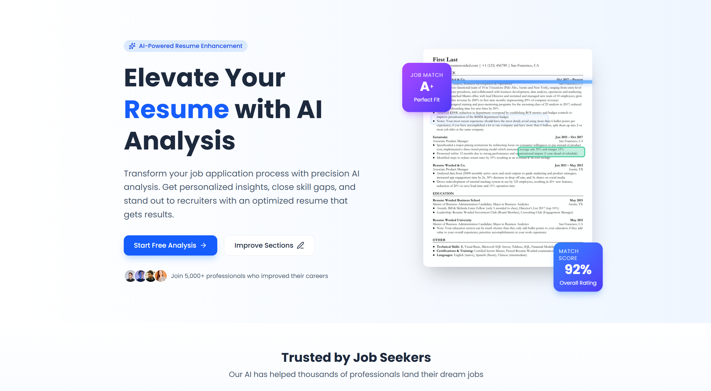

# 📄 ResumeInsight - AI-Powered Resume Analyzer

<div align="center">
  
  
  
  **Transform your job application process with precision AI analysis**
  
  [](https://nextjs.org/)
  [](https://reactjs.org/)
  [](https://www.typescriptlang.org/)
  [](https://tailwindcss.com/)
  [](LICENSE)
  
  [Live Demo](https://resumeinsight.vercel.app) · [Report Bug](https://github.com/DevVaradPatil/resume-analyzer/issues) · [Request Feature](https://github.com/DevVaradPatil/resume-analyzer/issues)
  
</div>

---

## 🌟 Overview

ResumeInsight is a cutting-edge, AI-powered resume analysis platform that helps job seekers optimize their resumes for better career opportunities. Built with Next.js 16 and powered by Google's Gemini AI, it provides comprehensive insights, ATS optimization, and personalized recommendations to make your resume stand out.

### ✨ Key Features

- 🤖 **AI-Powered Analysis** - Leverages Google Gemini AI for intelligent resume evaluation
- 📊 **Comprehensive Analytics** - Detailed scoring across multiple dimensions
- 🎯 **Job Match Analysis** - Compare your resume against specific job descriptions
- 📝 **Section-by-Section Improvement** - Get targeted suggestions for each resume section
- 🔍 **ATS Optimization** - Ensure your resume passes Applicant Tracking Systems
- 💼 **Multi-Tier Subscriptions** - Free, Pro, and Executive plans
- 📱 **Responsive Design** - Perfect experience across all devices
- 🔐 **Secure Authentication** - Powered by Clerk
- 📈 **Usage Analytics** - Track your progress with Vercel Analytics
- 🌐 **SEO Optimized** - Built-in sitemap, robots.txt, and structured data

---

## 🚀 Quick Start

### Prerequisites

- Node.js 18.x or higher
- npm, yarn, pnpm, or bun
- Google Gemini API key
- Clerk account (for authentication)
- Supabase account (for database)

### Installation

1. **Clone the repository**
   ```bash
   git clone https://github.com/DevVaradPatil/resume-analyzer.git
   cd resume-analyzer/nextjs_project
   ```

2. **Install dependencies**
   ```bash
   npm install
   # or
   yarn install
   # or
   pnpm install
   ```

3. **Set up environment variables**
   ```bash
   cp .env.example .env.local
   ```
   
   Fill in your environment variables:
   ```env
   # App Configuration
   NEXT_PUBLIC_BASE_URL=http://localhost:3000
   
   # Google Gemini AI
   GEMINI_API_KEY=your_gemini_api_key_here
   
   # Clerk Authentication
   NEXT_PUBLIC_CLERK_PUBLISHABLE_KEY=your_clerk_publishable_key
   CLERK_SECRET_KEY=your_clerk_secret_key
   NEXT_PUBLIC_CLERK_SIGN_IN_URL=/sign-in
   NEXT_PUBLIC_CLERK_SIGN_UP_URL=/sign-up
   
   # Supabase Database
   NEXT_PUBLIC_SUPABASE_URL=your_supabase_url
   NEXT_PUBLIC_SUPABASE_ANON_KEY=your_supabase_anon_key
   SUPABASE_SERVICE_ROLE_KEY=your_supabase_service_role_key
   
   # Google AdSense (Optional)
   NEXT_PUBLIC_ADSENSE_PUBLISHER_ID=ca-pub-xxxxxxxxxxxxxxxx
   NEXT_PUBLIC_ADS_ENABLED=false
   ```

4. **Set up the database**
   
   Run the SQL schema files in your Supabase SQL Editor:
   ```bash
   # In order:
   supabase/schema.sql
   supabase/migrations/003_subscription_tables.sql
   supabase/migrations/004_cleanup_redundant_subscription_fields.sql
   ```

5. **Run the development server**
   ```bash
   npm run dev
   ```

6. **Open your browser**
   
   Navigate to [http://localhost:3000](http://localhost:3000)

---

## 🏗️ Project Structure

```
nextjs_project/
├── src/
│   ├── app/                      # Next.js App Router
│   │   ├── api/                  # API routes
│   │   │   ├── analyze/          # Resume analysis endpoint
│   │   │   ├── analyze-overall/  # Overall analytics endpoint
│   │   │   ├── improve-section/  # Section improvement endpoint
│   │   │   ├── subscription/     # Subscription management
│   │   │   └── dashboard/        # Dashboard data
│   │   ├── blog/                 # Blog pages
│   │   ├── dashboard/            # User dashboard
│   │   ├── resume-analysis/      # Resume analysis page
│   │   ├── analytics/            # Analytics page
│   │   ├── section-improvement/  # Section improvement page
│   │   ├── layout.js             # Root layout with metadata
│   │   ├── page.js               # Homepage
│   │   ├── sitemap.js            # Dynamic sitemap
│   │   └── robots.ts             # SEO robots configuration
│   ├── components/               # React components
│   │   ├── ads/                  # Google AdSense components
│   │   ├── FileUpload.js         # File upload component
│   │   ├── Header.js             # Navigation header
│   │   ├── Footer.js             # Footer component
│   │   ├── PricingSection.js     # Pricing display
│   │   ├── SubscriptionDashboard.js  # Subscription card
│   │   └── JsonLd.tsx            # Structured data component
│   └── lib/                      # Utility functions
│       ├── gemini-service.js     # AI service integration
│       ├── pdf-extractor.js      # PDF parsing
│       ├── subscription-service.js  # Subscription logic
│       ├── analytics.js          # Analytics tracking
│       └── structured-data.js    # SEO structured data
├── public/                       # Static assets
│   ├── assets/                   # Images and media
│   └── robots.txt               # Static robots file
├── supabase/                     # Database schemas
│   ├── schema.sql               # Main schema
│   └── migrations/              # Database migrations
└── package.json                 # Dependencies
```

---

## 💡 Core Features

### 1. **AI Resume Analysis**
- Upload PDF resumes (up to 25MB for Executive users)
- Get comprehensive AI-powered feedback
- Receive actionable improvement suggestions
- ATS compatibility checking

### 2. **Job Match Analysis**
- Compare resume against job descriptions
- Identify skill gaps
- Get personalized learning paths
- Optimize for specific roles

### 3. **Overall Analytics**
- Professional presentation score
- ATS readiness percentage
- Market competitiveness analysis
- Section-by-section breakdown

### 4. **Section Improvement**
- Target specific resume sections
- Professional summary enhancement
- Work experience optimization
- Skills section refinement
- Education formatting

### 5. **Subscription Management**
- **Free Tier**: 1 analysis per feature/month
- **Pro Tier** ($9.99/mo): 50 analyses per feature
- **Executive Tier** ($24.99/mo): Unlimited analyses
- File size limits: 2MB (Free), 10MB (Pro), 25MB (Executive)

### 6. **Dashboard & Analytics**
- Track analysis history
- View usage statistics
- Monitor subscription status
- Access recent analyses

---

## 🛠️ Tech Stack

### Frontend
- **Framework**: Next.js 16 (App Router)
- **UI Library**: React 19.1
- **Styling**: Tailwind CSS 4.0
- **Animations**: Framer Motion
- **Icons**: Lucide React
- **Fonts**: Google Fonts (Poppins)

### Backend
- **API Routes**: Next.js API Routes
- **AI Service**: Google Gemini AI
- **Authentication**: Clerk
- **Database**: Supabase (PostgreSQL)
- **File Processing**: PDF-Parse
- **Webhooks**: Svix

### DevOps & Monitoring
- **Hosting**: Vercel
- **Analytics**: Vercel Analytics
- **Speed Insights**: Vercel Speed Insights
- **SEO**: Next.js Metadata API

### Monetization
- **Ads**: Google AdSense integration
- **Payments**: Subscription-based (integration ready)

---

## 📊 Database Schema

### Key Tables

#### `users`
- User profile information
- Synced with Clerk authentication
- Role management (USER/ADMIN)

#### `user_subscriptions`
- Subscription tier (free/pro/executive)
- Billing information
- Period tracking
- Payment provider integration

#### `feature_usage`
- Monthly usage tracking
- Feature-specific limits
- Usage period management

#### `resumes`
- Uploaded resume data
- Analysis results (JSON)
- File metadata
- Analysis types

#### `resume_analysis_logs`
- Detailed analysis logs
- Token usage tracking
- Performance metrics
- Error tracking

---

## 🎨 Features in Detail

### Authentication & Authorization
- Secure user authentication via Clerk
- Role-based access control
- Session management
- OAuth support

### Subscription System
- Tiered pricing model
- Usage limit enforcement
- File size restrictions
- Automatic quota reset
- Payment integration ready

### AI Integration
- Google Gemini 1.5 Flash
- Optimized prompts for accuracy
- Token usage tracking
- Error handling and retries
- Response parsing and validation

### SEO & Performance
- Dynamic sitemap generation
- Robots.txt configuration
- Structured data (JSON-LD)
- Open Graph meta tags
- Twitter Card integration
- Image optimization
- Code splitting
- Lazy loading

### Monetization
- Google AdSense integration
- Ad-free experience for paid users
- Strategic ad placements
- Lazy loading for performance

---

## 🔧 Configuration

### Environment Variables

| Variable | Description | Required |
|----------|-------------|----------|
| `NEXT_PUBLIC_BASE_URL` | Base URL for the app | Yes |
| `GEMINI_API_KEY` | Google Gemini API key | Yes |
| `NEXT_PUBLIC_CLERK_PUBLISHABLE_KEY` | Clerk public key | Yes |
| `CLERK_SECRET_KEY` | Clerk secret key | Yes |
| `NEXT_PUBLIC_SUPABASE_URL` | Supabase project URL | Yes |
| `NEXT_PUBLIC_SUPABASE_ANON_KEY` | Supabase anon key | Yes |
| `SUPABASE_SERVICE_ROLE_KEY` | Supabase service role key | Yes |
| `NEXT_PUBLIC_ADSENSE_PUBLISHER_ID` | AdSense publisher ID | No |
| `NEXT_PUBLIC_ADS_ENABLED` | Enable/disable ads | No |

---

## 📝 API Documentation

### Resume Analysis Endpoints

#### `POST /api/analyze`
Analyzes resume against job description
- **Body**: `FormData` with `resume` (PDF) and `job_description` (text)
- **Response**: Comprehensive analysis with match score

#### `POST /api/analyze-overall`
Provides overall resume analytics
- **Body**: `FormData` with `resume` (PDF)
- **Response**: Detailed metrics and scoring

#### `POST /api/improve-section`
Suggests improvements for specific sections
- **Body**: JSON with `section_type` and `original_text`
- **Response**: Improved version with recommendations

### Subscription Endpoints

#### `GET /api/subscription/status`
Get current subscription status
- **Response**: Tier, limits, usage, and expiry

#### `POST /api/subscription/init`
Initialize subscription for new users
- **Response**: Created subscription record

---

## 🚢 Deployment

### Deploy to Vercel

1. **Push to GitHub**
   ```bash
   git push origin main
   ```

2. **Import to Vercel**
   - Go to [Vercel Dashboard](https://vercel.com/new)
   - Import your GitHub repository
   - Configure environment variables
   - Deploy

3. **Configure Custom Domain** (Optional)
   - Add domain in Vercel settings
   - Update DNS records
   - Update `NEXT_PUBLIC_BASE_URL`

### Post-Deployment

1. **Submit Sitemap to Google**
   - Go to [Google Search Console](https://search.google.com/search-console)
   - Add property: `https://yourdomain.com`
   - Submit sitemap: `https://yourdomain.com/sitemap.xml`

2. **Configure Webhooks**
   - Set up Clerk webhooks for user sync
   - Configure payment webhooks (if using)

---

## 🧪 Testing

```bash
# Run development server
npm run dev

# Build for production
npm run build

# Start production server
npm start
```

### Test Coverage
- User authentication flows
- Resume upload and analysis
- Subscription limit enforcement
- File size validation
- API error handling

---

## 🤝 Contributing

Contributions are welcome! Please follow these steps:

1. Fork the repository
2. Create a feature branch (`git checkout -b feature/AmazingFeature`)
3. Commit your changes (`git commit -m 'Add some AmazingFeature'`)
4. Push to the branch (`git push origin feature/AmazingFeature`)
5. Open a Pull Request

### Development Guidelines
- Follow existing code style
- Write meaningful commit messages
- Update documentation as needed
- Test thoroughly before submitting

---

## 📄 License

This project is licensed under the MIT License - see the [LICENSE](LICENSE) file for details.

---

## 👥 Authors

- **Varad Patil** - *Initial work* - [@DevVaradPatil](https://github.com/DevVaradPatil)

---

## 🙏 Acknowledgments

- [Next.js](https://nextjs.org/) - The React framework
- [Google Gemini](https://ai.google.dev/) - AI capabilities
- [Clerk](https://clerk.com/) - Authentication
- [Supabase](https://supabase.com/) - Database and backend
- [Vercel](https://vercel.com/) - Hosting and deployment
- [Tailwind CSS](https://tailwindcss.com/) - Styling framework
- [Lucide](https://lucide.dev/) - Beautiful icons

---

## 📞 Support

- 📧 Email: varadapatil123@gmail.com
- 💬 [GitHub Discussions](https://github.com/DevVaradPatil/resume-analyzer/discussions)
- 🐛 [Issue Tracker](https://github.com/DevVaradPatil/resume-analyzer/issues)
- 📖 [Documentation](https://github.com/DevVaradPatil/resume-analyzer/wiki)

---

## 🗺️ Roadmap

- [ ] Payment gateway integration (Stripe/Razorpay)
- [ ] Resume template suggestions
- [ ] LinkedIn profile import
- [ ] Cover letter generator
- [ ] Interview preparation tools
- [ ] Mobile app (React Native)
- [ ] Multi-language support
- [ ] Resume comparison feature
- [ ] Industry-specific templates
- [ ] Career coaching integration

---

## 📊 Project Stats


---

<div align="center">
  
  **Made with ❤️ by [Varad Patil](https://github.com/DevVaradPatil)**
  
  If you found this project helpful, please consider giving it a ⭐!
  
</div>
